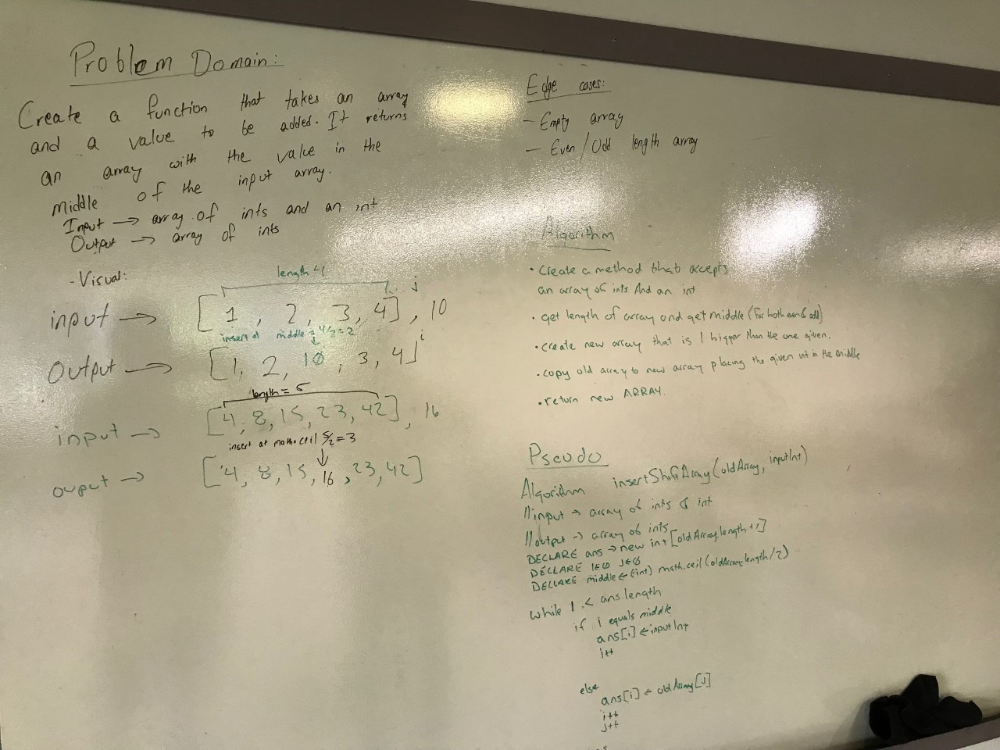

# Code Challenge: Class 02:

## Challenge Summary:
Write a function called insertShiftArray which takes in an array and the value to be added. Without utilizing any of the built-in methods available to your language, return an array with the new value added at the middle index.

## Approach and efficiency:
I itried to approach this problem by first creating a method that would accept an integer array and an integer as parameters. Then I determined the midway point of the array's length by dividing the length by two. If the array was odd, I added one to the length of the array and then divided it by two. The initial plan was to do math.ceil which did not work for odd numbers for some reason, so I had to take slightly different approach. Then I created a while loop which copied the items of the original array to a new array (whoise length is one more than original array) untill midway point, and inserted the integer at the midway point, and the rest of the items of the original array were copied afterwards. I returned the new array as output. Then the method was tested for two different scenarios: one for odd number lengthed array and one for even. 

## Solution:

## [Link to arrayShift.java](https://github.com/sadhikari07/data-structures-and-algorithms/blob/master/401_code_challenges/array_shift/src/main/java/array_shift/ArrayShift.java)

## [Link to arrayShiftTest.java](https://github.com/sadhikari07/data-structures-and-algorithms/blob/master/401_code_challenges/array_shift/src/test/java/array_shift/ArrayShiftTest.java)
